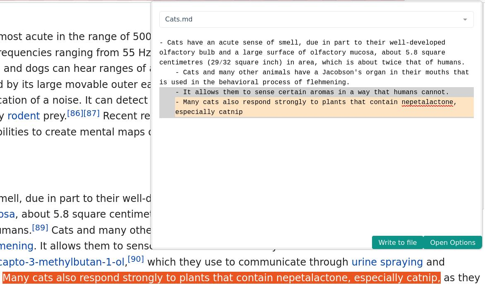

# Obsidian Browser2Note
> WARNING: This project is in heavy development.

Send editable highlighted text (and their URL) to ObsidianMD notes, quickly & flexibly!

This is a browser extension that supports Firefox & probably Chrome (needs testing). 
It is intended for an outline-heavy workflow.

## Features
- Send user-editable highlighted text & URL to a note
- Select any line of text to place the your text under
- Many keyboard shortcuts!
- Automatically adds/removes bullet points based on context
- Visually hides Markdown links from the user while viewing an existing note

## What it looks like
---

---

## Prerequisites
- Requires the [obsidian-local-rest-api](https://github.com/coddingtonbear/obsidian-local-rest-api) plugin

## Getting started
- Install this browser extension & the prerequisites
- (This will be fixed later) in your [obsidian-local-rest-api](https://github.com/coddingtonbear/obsidian-local-rest-api) settings you must use 'Enable Insecure HTTP Server'
- Paste [obsidian-local-rest-api](https://github.com/coddingtonbear/obsidian-local-rest-api) 's key the Browser2Note settings

## Usage
Typical workflow is like this:
- Highlight text in your browser
- Open the Browser2Note popup (can be activated via shortcut)
- Choose a file to place the highlight/information in
- Click a line to place the highlight under
- Indent/Unindent the highlight as needed
- Edit the highlight as needed
- Press 'Write to File'

Keep in mind that there are plenty of shortcuts to make this process easier.

## Similar Projects
[obsidian-web](https://github.com/coddingtonbear/obsidian-web) is similar;
it allows for creating, storing, & appending to notes. It offers some flexibility for appending, but I wanted more;
Browser2Note allows you to add text to any part of an existing note, as well as see its contents. It also comes with
many useful features as stated above!

## Contributing
If you'd like to contribute, feel free! This plugin was firstly written for my own use, and in a short amount of time.
I will take any help I can get!
